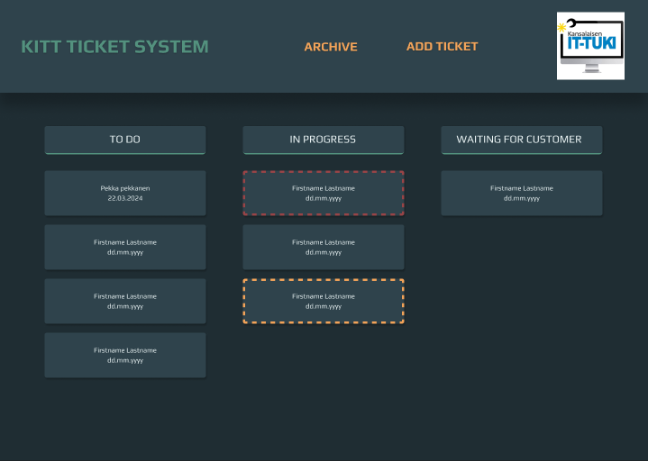
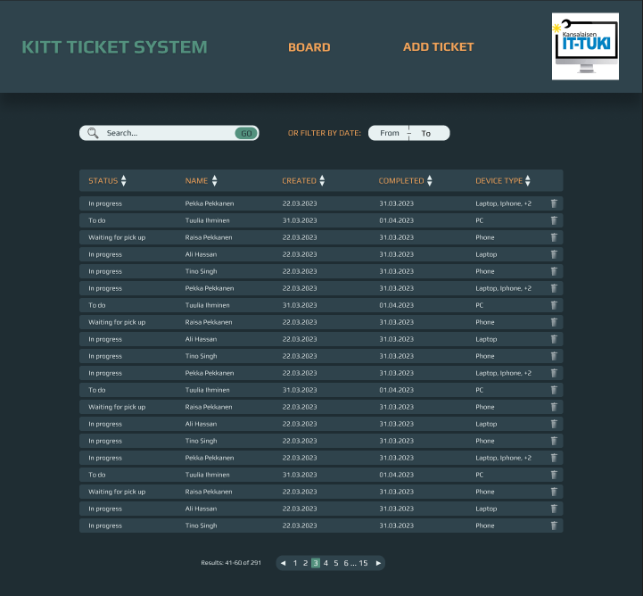

Welcome!

This is my UI&UX -design portfolio for possible employers and it is created with a Markdown file.

# UI & UX portfolio
## Linda Ranne

### Project gate 2.0
This project is an internal project in the student project office theFIRMA which is part of Turku university of applied sciences. 
Project's outcome is an application for students and teacher to better manage project human resources and to follow up project and student progress. 
I've created the design for the mobile version together with another student. These pictures are purely my work. 
Fonts, colours and some other features were given due to the existence of a design for the web version of the application. 

### Citizen's helpdesk ticket system
This project was also an internal project. Citizen's helpdesk (Kansalaisen IT-tuki) needed their own ticket system
and I got to create the design for it. Here are few examples of the design.

<

